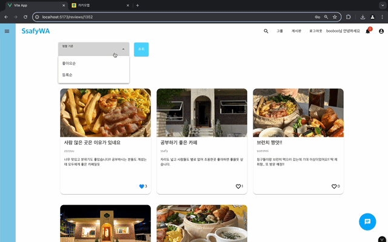
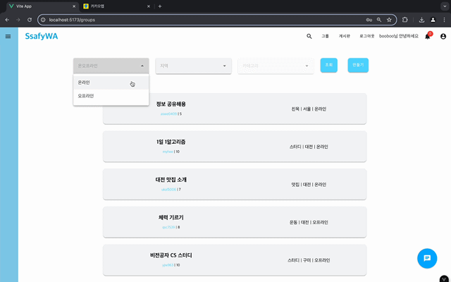

# Enjoy Trip Project

## [Final PJT]

### SsafyWA

### 윤보은 | 이소민

### 2024.05.24

#### 목차

1. 기획 배경 및 목표
2. 추진 일정
3. 시장분석
4. 개발 기술 및 결과
5. 개발환경 및 전체 시스템 구조도 -> 설계서서
6. 화면 흐름도(주요 화면) - 시연 동영상
7. 적용한 패턴 및 핵심 알고리즘
8. 기대효과
9. 개발후기

## 기획 배경 및 목표

- 여행이란 일상에서 벗어나 타지역으로 떠나는 일이라고 합니다. 이러한 "여행"이라는 주제로 타지역에 잠시 지내야 하는 많은 ssafy 교육생을 대상으로 프로젝트를 기획했습니다.

- 자신의 캠퍼스 주변 시설을 검색할 수 있고, 스터디/밥메이트/공동구매 등 그룹을 자유롭게 구하여 같은 지역 친구를 사귈 수 있게 하며 자유롭게 같은 ssafy 동료들과 소통을 할 수 있도록 목표로 삼았습니다. 이로서 사용자가 낯선 곳과 익숙해지는 것을 돕고 아는 사람이 없는 외로움을 극복하게 도와주며 더욱 알찬 1년을 보낼 수 있도록 할겁니다.
- 직접 ssafy를 다니는 교육생들로서 누구보다 ssafy 교육생들의 니즈 파악을 확실히 할 수 있었습니다. 낯선 환경과 처음 듣는 교육 과정들로서 모르는 것은 매번 생기고 질문할 곳이 없고 프로님들, 강사님들도 계시고 Mattermost과 ssafy 오픈 카톡톡방도 있지만 직접 물어보는 것이 어려워 궁금증을 참아야 하는 경우가 많습니다. 공개적으로 질문하고 자신이 직접 나서서 무언가를 해야하는 것보다는 대학생들의 에브리타임 같은 커뮤니티를 통해서 이러한 어려움을 손쉽게 이겨낼 수 있을 겁니다. 공부를 하며 틈틈이 같은 반 친구들과 놀러 가고 싶어도 주변 시설이 익숙하지 않아 밥 먹는 것을 찾는 것을 가장 어려워 하는 것을 많이 보았습니다.

→ SsafyWA를 통해서 쉽게 다른 사람들에게 다가가고 ssafy를 다니며 자신에게 필요한 것을 얻을 수 있을 걸로 보입니다.

## 추진 일정

프로젝트 구상
데이터 수집
데이터 분류
화면 설계
로그인 및 회원 가입 구현
게시판 장소 검색
기본 기능 이후 추가 기능 구상
그룹 기능
알림/쪽지/채팅 기능
버그 고치며 디테일 잡기

## 시장 분석

: 싸피생에게는 에듀싸피와 Mattermost이라는 것이 있지만 원활하게 모두와 소통할 수 있는 특징이 부족하다고 느꼈습니다. 모두에게 자신의 신분을 들어내고 무엇을 물어보거나 올리기 부담스러운 면이 있어 편하게 자신이 필요한 것을 얻을 수 있는 어플이 필요하다고 느꼈습니다.

## 개발 기술 및 결과

→ aws의 s3 라는 스토리지 서비스 (이미지 업로드와 저장)
→ web socket와 STOMP (간단한 메시지를 전송하기 위한 프로토콜, pub / sub란 메세지를 공급하는 주체와 소비하는 주체를 분리해 제공하는 메세징 방법) → 실시간 통신 (알림 + 채팅팅)
→ Toast editor → 마크다운 형식의 게시글 작성 가능
→ JWT 토큰을 이용한 로그인 세션 처리

## 개발환경 및 전체 시스템 구조도

- 요구사항 정의서(Usecase Diagram)

  

---

- 테이블 구조도(ERD)
  

---

- 클래스 다이어그램

  

---

- 화면 설계서

  

---

## 주요 기능 소개 - 화면 흐름도

---

### 로그인 및 회원가입

→ 로그인 및 회원가입을 통해 커뮤니티를 이용할 수 있습니다.

→ 공개되지 않고 SSAFY 교육생들만 이용할 수 있는 커뮤니티라는 것을 강조하기 위해 사이트 접속을 위해 로그인을 먼저하도록 설정하였습니다. 이럼으로서 가입하지 않은 외부인은 사이트의 기능을 이용할 수 없습니다.

---

---

### 게시판

→ 게시판을 카테고리로 나누어 더 완성도 있고 실용성 있는 웹페이지를 만들 수 있었습니다.

|                         우리 게시판                         |       게시판 카테고리별로 보기       |
| :---------------------------------------------------------: | :----------------------------------: |
|                                                             |       |
| 우리 게시판에서는 내가 등록한 캠퍼스의 글만 볼 수 있습니다. | 필요에 따라 게시판을 볼 수 있습니다. |

|                      게시글 쓰기                      |                게시글 댓글 작성 및 좋아요                 |
| :---------------------------------------------------: | :-------------------------------------------------------: |
|                        |                          |
| 카테고리를 골라 나만의 게시글을 업로드할 수 있습니다. | 게시글 좋아요 및 댓글을 달며 동료들과 소통할 수 있습니다. |

|                        게시글 정렬                        |                      인기/급상승 게시글 분류하기                       |
| :-------------------------------------------------------: | :--------------------------------------------------------------------: |
|                            |                     !                     |
| 좋아요순/조회수순/댓글순 정렬로 게시글 보기가 가능합니다. | 좋아요, 댓글, 조회수 가중치를 주며 인기글과 급상승글을 추출해냈습니다. |

---

---

### 장소 검색

→ 캠퍼스 중심으로 싸피 교육생들이 지낼만한 곳들을 추출하여 주변 장소 데이터를 가지고 와서 종류별로 쉽게 찾을 수 있게 분류하였습니다. 추가적으로 각 장소별로 리뷰 작성이 가능하게 하여 실제 싸피생들의 생생한 후기를 확인할 수 있습니다.

| 장소 검색 설정 | 장소 상세 페이지 |
| :--------------------------------------------------: | :---------------------------------------------: |
|  |  
 |
| 자신이 원하는 장소를 조건 설정해서 찾을 수 있습니다. | 장소의 구체적 정보와 리뷰를 조회할 수 있습니다. |

|                    리뷰 작성                    |                   리뷰 상세 페이지                   |
| :---------------------------------------------: | :--------------------------------------------------: |
|                    |                     |
| 자신이 방문한 장소를 리뷰를 작성할 수 있습니다. | 남들이 작성한 리뷰들을 보고 좋아요 누를 수 있습니다. |

---

---

### 그룹

→ 자신의 목적에 맞는 그룹을 직접 모집할 수 있습니다.

| 모집 중인 그룹 조회                         | 그룹 만들기                            |
| ------------------------------------------- | -------------------------------------- |
|                |         |
| 다른 사용자들이 만든 그룹을 볼 수 있습니다. | 직접 자신만의 그룹을 만들 수 있습니다. |

| 그룹 신청하기                                           | 그룹 멤버 추가하기                                                                 |
| ------------------------------------------------------- | ---------------------------------------------------------------------------------- |
|                        |                                               |
| 자신이 원하는 그룹을 신청하면 관리자에게 알림이 갑니다. | 자신이 관리자인 그룹의 정보를 수정하고 멤버를 ID 검색을 통해서 추가할 수 있습니다. |

→ 나의 페이지에서 자신이 관리자인 그룹과 일반 멤버인 그룹에 따라 자신이 가지는 권한이 다른 것까지 확인할 수 있습니다.

---

---

### 쪽지 보내기

→ 실시간으로 쪽지를 보내는 기능이 가능합니다.

| 쪽지 보내기                                                   | 나의 쪽지 페이지                                                 |
| ------------------------------------------------------------- | ---------------------------------------------------------------- |
|                              |                 |
| 커뮤니티 사용자에게 ID 검색을 통해서 쪽지를 보낼 수 있습니다. | 새로운 쪽지, 지금까지의 쪽지, 내가 쓴 쪽지를 조회할 수 있습니다. |

---

---

### 부가 기능

→ 자신의 정보를 조회, 수정할 수 있는 페이지

| 내가 좋아요 누른 것을 조회할 수 있습니다. | 내가 쓴 게시물과 속한 그룹을 조회할 수 있습니다.          |
| ----------------------------------------- | --------------------------------------------------------- |
|  |                          |
| 게시물과 장소 조회가 가능합니다.          | 내가 속한 게시물과 속속한 그룹을 조회/수정할 수 있습니다. |

---

---

## 적용한 패턴 및 핵심 알고리즘

- 좋아요, 댓글, 조회수에 가중치를 줌으로서 인기글과 급상승 게시물 분류를 할 수 있었습니다.

## 기대효과

- SSAFY 전용 커뮤니티를 활성화 시키면서 더욱 편안한 싸피 생활이 가능하게 될 것 같습니다.

## 보완할 점 및 앞으로 개발할 기능

그룹 채팅, 싸피생 인증 수단, 자신의 스케줄을 정리할 수 있는 기능(공부계획), 실제 만든 그룹의 일정 및 한 일들을 기록할 수 있는 기능 등을 추가 구현할 예정입니다.

## 개발후기

| 윤보은     | 이소민       |
| ---------- | ------------ |
| ㅇㅇㅇㅇㅇ | ㅇㅇㅇㅇㅇㅇ |

---

---
